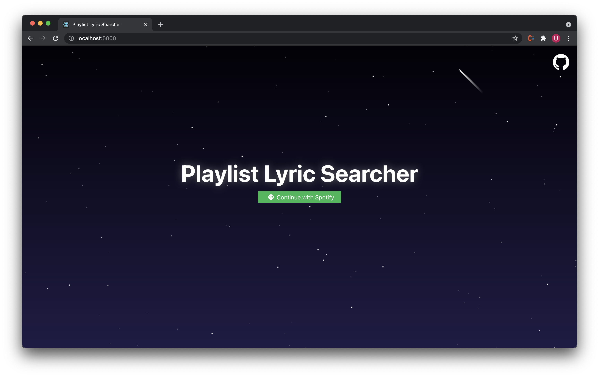

# Playlist Lyric Searcher

React web app to search for specific lyrics in your Spotify playlists.

## Gallery



## Development

```
git clone https://github.com/udbhav1/playlist-lyric-searcher
cd playlist-lyric-searcher
npm install
touch .env
```
Get your [Spotify](https://developer.spotify.com/dashboard/) and [Genius](https://genius.com/api-clients) API keys and fill out the `.env` file as follows:
```
REACT_APP_SPOTIFY_CLIENT_ID = ''
REACT_APP_SPOTIFY_CLIENT_SECRET = ''
REACT_APP_GENIUS_TOKEN = ''
PORT=5000
```
Finally,
```
npm start
```

## Notes

- Testing on localhost requires you to disable Same-Origin Policy in your browser to avoid a CORS error. Either install an extension for Chrome or follow the instructions [here](https://stackoverflow.com/questions/3102819/disable-same-origin-policy-in-chrome).
- The Genius API does not explicitly support lyric fetching. Instead, the app manually scrapes each Genius page, so you may run into rate-limit errors with especially large playlists (>1000 songs).
